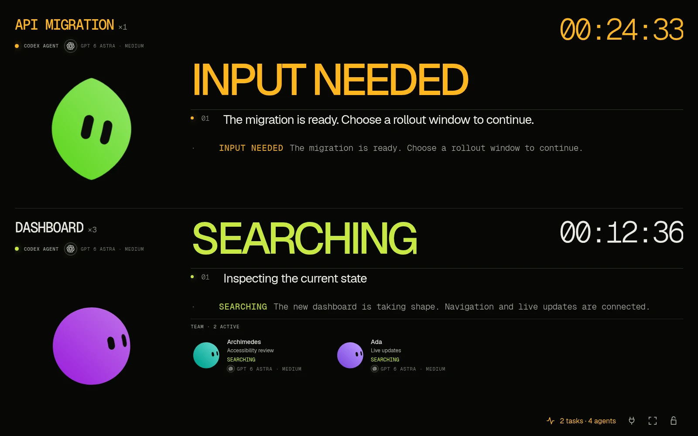
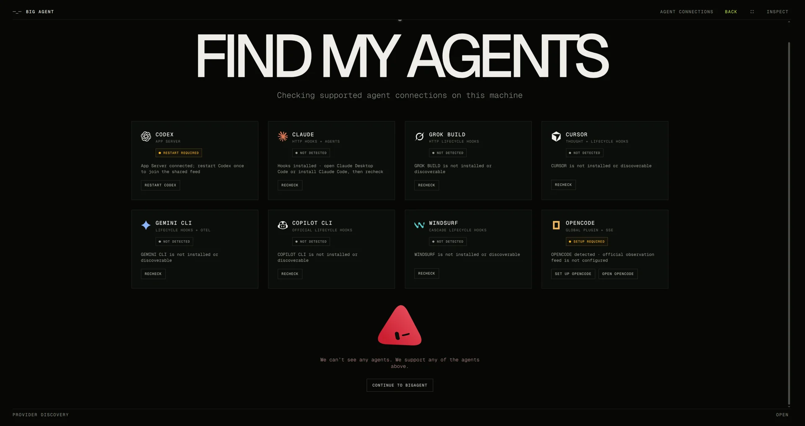

# BIG AGENT

An ambient, room-scale departures board for autonomous coding agents. BIG AGENT groups live sessions into stable workstreams, shows useful narrative activity instead of raw token streams, and makes completion, failure and requests for input visible from across the room.



> **Public alpha:** Linux x64 is locally validated. Windows x64 and macOS (Apple Silicon and Intel) now have native build and test workflows; they remain preview targets until those runs and native checks pass. See [platform support](docs/cross-platform.md).

## Try it

Download the installer for your platform from [GitHub Releases](https://github.com/marcodenic/BIGAGENT/releases) when available:

- **Linux:** download the `.AppImage`, make it executable, and open it.
- **Windows:** run the `win-x64.exe` installer.
- **Mac:** open the `mac-arm64.dmg` (Apple Silicon) or `mac-x64.dmg` (Intel) and move BIG AGENT to Applications.

Alpha builds are unsigned; macOS and Windows may show security warnings. Verify downloads against `SHA256SUMS`. For a blocked Mac install, see [Opening the unsigned Mac preview](#opening-the-unsigned-mac-preview).

The first-run **FIND MY AGENTS** screen detects supported providers. Nothing is added to another application's configuration until you click its setup button; every configured provider also offers **REMOVE INTEGRATION**.



## Opening the unsigned Mac preview

Mac previews are not yet signed with an Apple Developer ID or notarised by Apple. macOS may report that **“BIG AGENT is damaged and can’t be opened”**. This can be caused by the unsigned build; the message alone does not confirm that the download is intact.

Only use this workaround for a copy you trust from this repository's [GitHub Releases](https://github.com/marcodenic/BIGAGENT/releases). Check the downloaded DMG against the release's `SHA256SUMS` before proceeding. On a modern Mac with an M-series chip, choose `mac-arm64.dmg`; Intel Macs need `mac-x64.dmg`.

1. Click **Cancel** on the warning and drag **BIG AGENT** from the DMG into **Applications**.
2. Open **Terminal** and remove the download quarantine from this app:

   ```bash
   xattr -dr com.apple.quarantine "/Applications/BIG AGENT.app"
   ```

3. Open **BIG AGENT** from Applications again.

If it still fails because of its signature, you can apply a local ad-hoc signature, then try again:

```bash
codesign --force --deep --sign - "/Applications/BIG AGENT.app"
xattr -dr com.apple.quarantine "/Applications/BIG AGENT.app"
```

These commands apply only to BIG AGENT; they do not disable Gatekeeper system-wide. Removing quarantine bypasses the downloaded-app check for this copy. A local signature does not verify the publisher or provide Apple notarisation. You may need to repeat the workaround after installing another unsigned preview. If a command fails or the app still will not open, report the exact error rather than disabling macOS security globally.

## Supported providers

| Provider | Observation source |
| --- | --- |
| Codex | Local session files + App Server daemon |
| Claude Code | HTTP hooks + agent registry |
| Grok Build | HTTP lifecycle hooks |
| Cursor | Thought + lifecycle hooks |
| Gemini CLI | Lifecycle hooks + OpenTelemetry |
| GitHub Copilot CLI | Lifecycle hooks |
| Windsurf / Devin Desktop | Cascade lifecycle hooks |
| OpenCode | Global plugin + SSE |

Hosted Grok Bot and hosted Copilot jobs are not claimed as local integrations because they do not expose an equivalent localhost event feed.

Codex session files are monitored automatically, including Desktop versions that use a private App Server. No Codex restart or startup order is required. Live App Server events take priority for the same turn; unrelated desktop tasks remain visible. Set `BIG_AGENT_CODEX_FALLBACK=0` to disable session-file monitoring.

`BIG_AGENT_PORT` selects the local receiver port (default `19777`). Generated hooks and plugins use that port. After changing it, run provider setup again to update existing integrations; unrelated hooks are preserved. Standalone bridge commands also accept `BIG_AGENT_PORT`, with `BIG_AGENT_URL` taking precedence when supplied.

## Privacy and control

- Activity remains on the machine and in memory; BIG AGENT has no account or cloud upload path.
- The telemetry receiver binds only to `127.0.0.1:19777`, accepts JSON only, limits request size, and rejects non-local browser origins.
- Observation hooks are fail-open and cannot approve, deny or steer an agent.
- Existing provider settings and unrelated hooks are preserved.
- Privacy mode hides paths, commands, filenames and detailed labels.

See [PRIVACY.md](PRIVACY.md) for the exact local files used by optional integrations.

## Controls

`F` fullscreen · `Esc` exit fullscreen · `I` activity and status · `?` shortcuts. Open **Agent connections** to add, verify or remove provider integrations.

## Develop

Requires Node.js 24+ and the pnpm version declared in package.json.

```bash
pnpm install
pnpm dev
pnpm test
pnpm package
```

`pnpm package` creates native installers for the host platform. CI tests Linux, Windows, and both Mac architectures. Tag builds prepare a draft release with all installers and checksums after every job passes. See [platform development and release checks](docs/cross-platform.md).

Generic JSON events, JSONL streams, OpenTelemetry and ACP are also supported. Start with the [adapter guide](docs/adapters.md), [lifecycle contract](docs/lifecycle.md) or [protocol](docs/protocol.md).

## Licence

[MIT](LICENSE) — use it, remix it and ship your own version.

## Automatic idle display

While an agent is active, BIG AGENT keeps the display awake. Once system inactivity reaches the screen-off/screensaver timeout, it brings its window forward and enters fullscreen on its existing monitor. User activity restores its previous fullscreen, always-on-top, and minimized/hidden state. Escape dismisses automatic fullscreen until the next idle period. When all agents finish, the display wake request is released immediately so normal power management resumes, even while DONE rows remain visible.

Timeout detection reads Windows power/screen saver settings, macOS power/screen saver settings, GNOME/Cinnamon idle settings, KDE Plasma 6 display settings, or X11 screen saver/DPMS settings. Settings refresh every minute and on power-source changes. Unavailable settings use five minutes; detected disabled timers do not trigger automatic fullscreen. Set `BIG_AGENT_IDLE_SECONDS` to an explicit number of seconds, or `0` to disable automatic fullscreen. This does not disable the existing keep-awake behavior during active work.

Desktop security and window-manager rules still apply. Explicit screen locks are respected where lock detection is available. Wayland can restrict global idle detection, foreground activation, and monitor placement, so automatic presentation is best effort there. macOS and Windows require native validation.

Completed agents remain visible as DONE for 20 seconds, including when other workstreams are still running or a source drops an already completed session. An agent disappearing from a feed without a completion event is not assumed to have succeeded.

## Run recap

Once every participant in an observed run finishes, BIG AGENT shows ALL DONE with the total number of distinct agents and elapsed wall time. The familiar workstream characters celebrate briefly, then settle into happy expressions. Grouped agents share their workstream character with an agent count; names stay in Activity and status. Early finishers remain included after their live rows expire. The recap stays until new work begins and does not keep the screen awake. Waiting, errors, and missing feeds are never treated as successful completion.

SAVE IMAGE downloads an anonymous PNG of the characters, count, duration, and BIG AGENT branding. It excludes project names and activity details. Recaps remain in memory only and reset when the app restarts.

Character colours are generated across the full hue range on each app launch, with bounded brightness and saturation for the dark display. New workstreams avoid nearby hues already assigned in the session, using the largest available gap when needed. Colours remain stable throughout that launch, including live views, recaps, and exported images.
